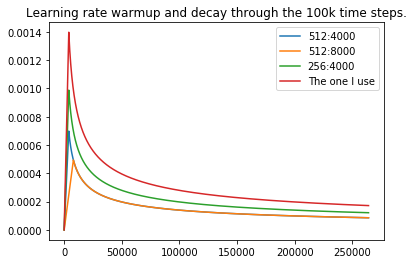
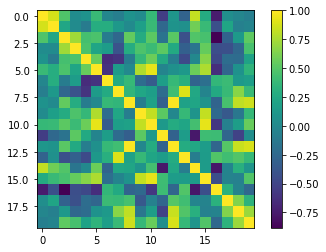
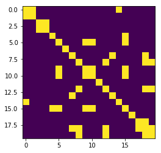
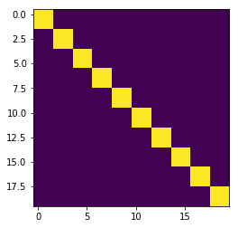

<h1 class="c31" id="h.yc648clsi59r"><span class="c2 c27"><a class="c5" href="https://www.google.com/url?q=https://github.com/guillaume-chevalier/SGNN-Transformer-Sentence-Model-SimilarityBXENT&amp;sa=D&amp;ust=1547475923454000">TP3 - </a></span><span class="c2"><a class="c5" href="https://www.google.com/url?q=https://github.com/guillaume-chevalier/SGNN-Transformer-Sentence-Model-SimilarityBXENT&amp;sa=D&amp;ust=1547475923454000">Project: SGNN-Transformer Sentence Model trained by the paragraph-skip-gram-like SimilarityBXENT</a></span></h1><p class="c0 c6"><span class="c4"></span></p><h2 class="c12" id="h.99knydkhl015">
<p class="c0 c6"><span class="c4"></span></p><h2 class="c12" id="h.93oxfc731382"><span class="c24">Introduction</span></h2><p class="c0"><span class="c4">The work hereby has been realized in solo, alone. It is mainly an experimentation. </span></p><p class="c0 c6"><span class="c4"></span></p><p class="c0"><span class="c4">First, a paper is reproduced (Self-Governing Neural Networks for On-Device Short Text Classification), but with a few twists so as to create something new. The purpose of this Self-Governing Neural Networks (SGNN) is to replace the embedding layer completely by a vector projection that derives from a featurization of the words and which is refined through fully-connected layers. </span></p><p class="c0 c6"><span class="c4"></span></p><p class="c0"><span class="c4">Second, an advanced experimentation is made in an attempt to train a sentence model in a completely novel way by reusing the code from the first experimentation and by comparing sentences to nearby sentences and to negative samples far from the sentence like how word2vec is trained. </span></p><p class="c0 c6"><span class="c4"></span></p><p class="c0"><span class="c4">Although the novel approach to training such a neural network (and without using embeddings) is very interesting, the model wasn&rsquo;t trained enough (only 2 days on a 1080 Ti card, 32 CPU cores and 32 GB of RAM). In other words : it gave approximately 70% accuracy on the sentiment classification task of the TP2 (more on TP2 later) when the sentence model was taken as a feature extractor for a logistic classifier (those accuracy-evaluation files aren&rsquo;t committed). Moreover, 2 days means probably only 1 day in GPU-time, since the data loading is a blocking operation as the data wasn&rsquo;t prefetched in parallel while training a batch. The first part of the project on implementing SGNNs is however at least considered successful. </span></p><p class="c0 c6"><span class="c4"></span></p><p class="c0"><span class="c4">The code for the first part is available at the following link, all of the code can be seen from reading the README Markdown document which is itself an exported Notebook : </span></p><p class="c0"><span class="c2"><a class="c5" href="https://www.google.com/url?q=https://github.com/guillaume-chevalier/SGNN-Self-Governing-Neural-Networks-Projection-Layer&amp;sa=D&amp;ust=1547475923462000">https://github.com/guillaume-chevalier/SGNN-Self-Governing-Neural-Networks-Projection-Layer</a></span><span class="c4">&nbsp;</span></p><p class="c0 c6"><span class="c4"></span></p><p class="c0"><span class="c4">Moreover, some online discussion is made about the first part on reproducing the paper: </span></p><ol class="c25 lst-kix_am8umhgw6fai-0 start" start="1"><li class="c0 c3 c1"><span class="c2"><a class="c5" href="https://www.google.com/url?q=https://stackoverflow.com/questions/53876974/how-is-hashing-implemented-in-sgnn-self-governing-neural-networks&amp;sa=D&amp;ust=1547475923463000">https://stackoverflow.com/questions/53876974/how-is-hashing-implemented-in-sgnn-self-governing-neural-networks</a></span><span class="c4">&nbsp;</span></li><li class="c0 c3 c1"><span class="c2"><a class="c5" href="https://www.google.com/url?q=https://github.com/guillaume-chevalier/SGNN-Self-Governing-Neural-Networks-Projection-Layer/issues/1&amp;sa=D&amp;ust=1547475923463000">https://github.com/guillaume-chevalier/SGNN-Self-Governing-Neural-Networks-Projection-Layer/issues/1</a></span><span class="c4">&nbsp;</span></li></ol><p class="c0 c6"><span class="c4"></span></p><p class="c0"><span class="c4">The content and discussions directly at the links above are to be considered a part of the report hereby and subject to evaluation. Especially, the discussion on the GitHub Issue #1 of the SGNN repo is quite interesting and even generates ideas. </span></p><p class="c0 c6"><span class="c4"></span></p><p class="c0 c6"><span class="c4"></span></p><p class="c0"><span class="c4">For the second part of the project, the code is available at the following link: </span></p><p class="c0"><span class="c2"><a class="c5" href="https://www.google.com/url?q=https://github.com/guillaume-chevalier/SGNN-Transformer-Sentence-Model-SimilarityBXENT&amp;sa=D&amp;ust=1547475923464000">https://github.com/guillaume-chevalier/SGNN-Transformer-Sentence-Model-SimilarityBXENT</a></span><span class="c4">&nbsp;</span></p><p class="c0 c6"><span class="c4"></span></p><p class="c0"><span>It is recommended to read notebooks before reading the code located in </span><span class="c8 c35">&ldquo;src/&rdquo;</span><span>. </span><span class="c4">The notebooks have been exported to the README, so reading the README is the same as reading the notebooks and the correspondingly named &ldquo;.py&rdquo; files. </span></p><p class="c0 c6"><span class="c4"></span></p><p class="c0 c6"><span class="c4"></span></p><p class="c0"><span>Also, the code used for converting wikipedia&rsquo;s wikicode/markupcode to raw text (.txt) is written from scratch (for the lack of non-copyleft python implementations after research), and is available here: </span><span class="c2"><a class="c5" href="https://www.google.com/url?q=https://github.com/guillaume-chevalier/Wikipedia-XML-Markup-Code-to-Plain-Text-Parser-of-Hell&amp;sa=D&amp;ust=1547475923466000">https://github.com/guillaume-chevalier/Wikipedia-XML-Markup-Code-to-Plain-Text-Parser-of-Hell</a></span><span class="c4">&nbsp;</span></p><p class="c0 c6"><span class="c4"></span></p><hr style="page-break-before:always;display:none;"><p class="c0 c6"><span class="c4"></span></p><h2 class="c12" id="h.vtjj3jnc766g"><span class="c26">Part 1 : Self-Governing Neural Networks (SGNNs)</span></h2><p class="c0 c6"><span class="c4"></span></p><p class="c0"><span class="c4">So as to summarize, the modified SGNN pipeline coded hereby works as such: </span></p><ol class="c25 lst-kix_aslkw1ikqrhb-0 start" start="1"><li class="c0 c3 c1"><span class="c4">Sentence Segmentation and Word Segmentation is performed. </span></li><li class="c0 c3 c1"><span class="c4">Word featurization is performed using a sklearn TF (CountVectorizer) with a char-level analyzer of n-grams (char n-gram word features). Word beginning and word end markers are added as a special character for the char n-gram word features to be more pertinent. </span></li><li class="c0 c3 c1"><span class="c4">A projection of those features are made to a 1120-dimensional space (vector) using Random Projection, a Locally-Sensitive Hashing algorithm that somehow preserves the cosine similarity of the projections. The sklearn class for this is SparseRandomProjection. There are 80 instances of SparseRandomProjection in parallel with a feature union, each generating 14 features, yielding a 80*14=1120 feature per word (1120-dimensional word vectors). </span></li><li class="c0 c3 c1"><span class="c4">Those word projections can now replace embeddings in sentence models, which is performed later in the part 2 of the project : coding a sentence model. </span></li></ol><p class="c0 c6"><span class="c4"></span></p><p class="c0"><span class="c4">The main differences with the real SGNN are as follow : </span></p><ul class="c25 lst-kix_wkjo67cuanso-0 start"><li class="c0 c3 c1"><span class="c4">Here, char n-grams are used for word features, whereas apparently &ldquo;skip-grams&rdquo; are used to featurize words in the original paper. This remains a mystery, the StackOverflow question has 3 stars and 0 answers, and the discussion in the Issue of the SGNN code implementation (handed-in hereby) yields no clear answers for what regards word featurization. </span></li><li class="c0 c3 c1"><span class="c4">The SparseRandomProjection function used here doesn&rsquo;t yield binary word features. Here, instead, it yield quantized integers remapped by a ~=1 scalar constant that makes them float features. Overall, it&rsquo;s quite similar, there is probably and in practice just a bit more than twice the usual quantity of information in the 1120-dimensional projections used hereby. </span></li><li class="c0 c1 c3"><span class="c4">Also, in the SGNN paper (and/or its precursor by the same author: the &ldquo;ProjectionNet&rdquo;), a few trainable fully-connected layers are added at the end of the SGNN to refine the word projections to learn to remap specific words to a higher level of abstraction (not just word char n-gram hashed/subsampled features). The training procedure here is : none. The training of those layers will however and at least be implemented in the part 2 of the present project, trained jointly (end to end) with the sentence model. Therefore, the training part is ignored here and will be discussed in part 2 below. </span></li></ul><p class="c0 c6"><span class="c4"></span></p><p class="c0"><span>Also, between part 1 and part 2, an important change was made. Instead of using a FeatureUnion over T=80 random hashers of d=14 dimensions (80*14=1120 word features), only one random hasher (1*1120) was finally used, which resulted in a dramatic speedup with the scikit-learn implementation. Thanks to Sava Kalbachou for the hint that 1 random hasher could be used as well, which was later discussed in the Issue #1 of the SGNN reproduction code on GitHub. </span><hr style="page-break-before:always;display:none;"></p><h3 class="c13" id="h.ke0tvdo7infb"><span class="c23">Word-Level Feature Extraction with character n-grams</span></h3><p class="c0 c6"><span class="c4"></span></p><p class="c0"><span class="c4">The n-gram range is from 1 to 3 on characters. For lack of an optimized implementation that would use tuples of (feature_idx, feature_value) for the generated n-grams sent to the LSH, the following function is used for sending to the pipeline containing the CountVectorizer : </span></p><p class="c0 c6"><span class="c4"></span></p><p class="c0 c1"><span class="c7">def generate_a_few_char_n_grams():</span></p><p class="c0 c1"><span class="c7">&nbsp; &nbsp; all_possible_0_to_3_grams = [&quot; &quot;]</span></p><p class="c0 c1"><span class="c7">&nbsp; &nbsp; less_printable = list(</span></p><p class="c0 c1"><span class="c7">&nbsp; &nbsp; &nbsp; &nbsp; set(string.printable) - set(string.digits) - {&quot; &quot;}</span></p><p class="c0 c1"><span class="c7">&nbsp; &nbsp; )</span></p><p class="c0 c1"><span class="c7">&nbsp; &nbsp; for a in less_printable:</span></p><p class="c0 c1"><span class="c7">&nbsp; &nbsp; &nbsp; &nbsp; all_possible_0_to_3_grams.append(a)</span></p><p class="c0 c1"><span class="c7">&nbsp; &nbsp; &nbsp; &nbsp; for b in less_printable:</span></p><p class="c0 c1"><span class="c7">&nbsp; &nbsp; &nbsp; &nbsp; &nbsp; &nbsp; all_possible_0_to_3_grams.append(a + b)</span></p><p class="c0 c1"><span class="c7">&nbsp; &nbsp; &nbsp; &nbsp; &nbsp; &nbsp; for c in string.ascii_lowercase:</span></p><p class="c0 c1"><span class="c7">&nbsp; &nbsp; &nbsp; &nbsp; &nbsp; &nbsp; &nbsp; &nbsp; all_possible_0_to_3_grams.append(a + c + b)</span></p><p class="c0 c1"><span class="c7">&nbsp; &nbsp; for a in string.digits:</span></p><p class="c0 c1"><span class="c7">&nbsp; &nbsp; &nbsp; &nbsp; all_possible_0_to_3_grams.append(a)</span></p><p class="c0 c1"><span class="c7">&nbsp; &nbsp; &nbsp; &nbsp; for b in string.digits:</span></p><p class="c0 c1"><span class="c7">&nbsp; &nbsp; &nbsp; &nbsp; &nbsp; &nbsp; all_possible_0_to_3_grams.append(a + b)</span></p><p class="c0 c1"><span class="c7">&nbsp; &nbsp; return &quot; &quot;.join(all_possible_0_to_3_grams)</span></p><p class="c0 c6"><span class="c4"></span></p><p class="c0"><span class="c4">This yields approximately 20&rsquo;000 to 30&rsquo;000 features per word. With all characters, this would be in the order of millions (M). It is to be clearly noted that more features shouldn&#39;t make the program slower if the data structure for the features were a (feature_idx, feature_value) tuple instead of a matrix as implemented in scikit-learn. Because of the implementation of scikit-learn, the restriction to 30k features here was good for speed, more than that would be too much currently. </span></p><p class="c0 c6"><span class="c4"></span></p><h3 class="c13" id="h.jd2oznydunye"><span>Locality-Sensitive Hashing (LSH): Random Hashing</span></h3><p class="c0 c6"><span class="c4"></span></p><p class="c0"><span class="c4">Put as simply as possible: normally, Random Hashing consists of drawing &ldquo;d&rdquo; hyperplanes in the feature space to encode features with a 0 or a 1 whether they sit above or below the plane, such as to have a d-dimensional binary feature vector after hashing. It is technically a hashing function that maximizes collisions. It therefore preserves cosine similarity, but with losses. </span></p><p class="c0 c6"><span class="c4"></span></p><p class="c0"><span class="c4">The SparseRandomProjection implementation from scikit-learn here is a bit different. First, it yields quantized floats (a.k.a. integers multiplied by a constant) instead of booleans. Also, the current implementation requires pre-building the sparse feature matrix (CSR-like), which could be completely avoided if using a tuple of (feature_idx, feature_value) instead of a matrix as implemented in scikit-learn. In other words, the random hashing could be computed all on-the-fly simply from a seed, given the tuples of (feature_idx, feature_value), without having to compute a matrix (CSR-like), as stated in the original SGNN paper. The scikit-learn was simple to use so no extra effort were made here for optimizing the thing. Done inside the GPU, the word featurization + lsh could be performed extremely faster. </span></p><p class="c0 c6"><span class="c4"></span></p><p class="c0"><span class="c4">Overall, using the proper data structure would have caused the feature extraction (char n-gram) step and the LSH step not to require being fitted. They could be completely dynamic without requiring a fitting step (only a transform step). </span></p><p class="c0 c6"><span class="c4"></span></p><h2 class="c12" id="h.kqigmv60i28p"><span class="c26">Part 2 : SGNN-Transformer Sentence Model trained by Skip-Gram SimilarityBXENT</span></h2><p class="c0 c6"><span class="c4"></span></p><p class="c0"><span class="c4">The SGNN projection layer coded in part 1 replaces the embedding layer in the encode (no decoder) of the Attention Is All You Need&rsquo;s Transformer Network. At the encoding output, the transformer network has a max pooling operation which reduces information across the word dimension (a.k.a. the time-step-like dimension if it was an RNN instead of a transformer for example). </span></p><p class="c0 c6"><span class="c4"></span></p><p class="c0"><span class="c4">At the end of the network, sentence representations are obtained. One flaw here is that they are a bottleneck because they are of the same dimensionality of the word representations themselves: no dimension-augmenting linear was taken before the max pooling. Overall, the model trained has 512 dimensions per word, and once reduced, represent each sentences with 512 dimensions. It is estimated that 2000 instead of 512 would perform better at the sentence level. This wasn&rsquo;t coded for the lack of time this being a small holidays project / course final project. </span></p><h3 class="c13" id="h.l02n3s4joo07"><span class="c23">The data</span></h3><p class="c0"><span class="c4">The whole is trained on Wikipedia EN. For the lack of finding a simple to use or a non-GPL python implementation of wikicode (wikipedia&rsquo;s markdown-like code) converter to raw text (.txt), new code is written with dirty and imperfect regexes. The code is available here: </span></p><p class="c0"><span class="c2"><a class="c5" href="https://www.google.com/url?q=https://github.com/guillaume-chevalier/Wikipedia-XML-Markup-Code-to-Plain-Text-Parser-of-Hell&amp;sa=D&amp;ust=1547475923474000">https://github.com/guillaume-chevalier/Wikipedia-XML-Markup-Code-to-Plain-Text-Parser-of-Hell</a></span><span class="c4">&nbsp;</span></p><p class="c0 c6"><span class="c4"></span></p><p class="c0"><span class="c4">The code parser/converter is almost perfect, but has a few flaws that are detailed more in the GitHub issues, mostly, some xml-like &ldquo;&lt;tags&gt;&rdquo; aren&rsquo;t removed.</span></p><hr style="page-break-before:always;display:none;"><p class="c0 c6"><span class="c4"></span></p><h3 class="c13" id="h.f56dmsnzkd8b"><span class="c23">The post-SGNN projection layer</span></h3><p class="c0 c6"><span class="c4"></span></p><p class="c0"><span class="c4">Sentences are converted to a list of word projections with the SGNN pipeline of the part 1. </span></p><p class="c0 c6"><span class="c4"></span></p><p class="c0"><span class="c4">A fully-connected layer converts the 1120 dimensions of the SGNN to d=512 dimensions for the following AIAYN encoder model and replaces word embeddings. The word representations now comes from the projections + fully-connected layer. </span></p><p class="c0 c6"><span class="c4"></span></p><h3 class="c13" id="h.inz4kkz0vbz2"><span class="c23">The Transformer Network: Attention Is All You Need (AIAYN)</span></h3><p class="c0 c6"><span class="c4"></span></p><p class="c0"><span class="c4">The code for this part is extracted directly from the Annotated Transformer : </span></p><ul class="c25 lst-kix_4u1ix5tqo679-0 start"><li class="c0 c3 c1"><span>Article : </span><span class="c2"><a class="c5" href="https://www.google.com/url?q=http://nlp.seas.harvard.edu/2018/04/03/attention.html&amp;sa=D&amp;ust=1547475923476000">http://nlp.seas.harvard.edu/2018/04/03/attention.html</a></span><span class="c4">&nbsp;</span></li><li class="c0 c3 c1"><span>Repo : </span><span class="c2"><a class="c5" href="https://www.google.com/url?q=https://github.com/harvardnlp/annotated-transformer&amp;sa=D&amp;ust=1547475923476000">https://github.com/harvardnlp/annotated-transformer</a></span><span class="c4">&nbsp;</span></li></ul><p class="c0 c6"><span class="c4"></span></p><p class="c0"><span class="c4">Compared to the original code in the repository linked just-above, the present code sees its dropout completely removed to make training faster (in terms of epochs spent before hoping to see convergence). </span></p><h3 class="c13" id="h.11q2pklp8l5j"><span class="c23">SimilarityBXENT: a similarity matrix loss trained &agrave; la skip-gram</span></h3><p class="c0 c6"><span class="c4"></span></p><p class="c0"><span>Simply put, the </span><span class="c8">SimilarityBXENT</span><span>&nbsp;is simply a paragraph-level skip-gram with grouped negative sampling, where sentences are normalized, and all compared to each other with cosine similarity, which is optimized to match the </span><span class="c8">block diagonal matrix</span><span class="c4">&nbsp;where each block is the sentences of a paragraphs. The sentences of a block are trained to be similar to each other, and dissimilar to other paragraphs&rsquo;s sentences, thus imitating the negative sampling of a word2vec training, without embeddings nor softmax but rather at sentence level with a similarity matrix and binary cross-entropy. </span></p><p class="c0 c6"><span class="c4"></span></p><p class="c0"><span>The transformer outputs a tensor of shape </span><span class="c8">(batch_size, 512)</span><span class="c4">, where 512 is the featurized sentence. </span></p><p class="c0 c6"><span class="c4"></span></p><p class="c0"><span>This tensor is sent to what is hereby coined a SimilarityBXENT (or in the present code, a &ldquo;Trainer model&rdquo;). First, the </span><span class="c8">sentence features are normalized (not batch normalization nor layer normalization) each to a norm (radius) of 1.0</span><span>. Then, they are each compared to each other with cosine similarity, which yields a similarity matrix of shape </span><span class="c8">(batch_size, batch_size)</span><span class="c4">, which is symmetric and which&rsquo;s diagonal contains ones (1). </span></p><p class="c0 c6"><span class="c4"></span></p><p class="c0"><span class="c4">The loss function and the training method is inspired from word2vec&rsquo;s skip-gram training method with negative sampling, and from John Rupert Firth&rsquo;s famous quote: </span></p><p class="c0 c18"><span class="c19">You shall know a word by the company it keeps (Firth, J. R. 1957:11)</span></p><p class="c0 c6"><span class="c4"></span></p><p class="c0"><span>However, here, we are at sentence-level. Which means we train the network to say that sentences in the same paragraphs are similar, and that sentences not in the same paragraph are different from the ones of another paragraph. Here the split is really performed on Wikipedia paragraphs (with a max sentence count) rather than a predefined window of let&rsquo;s say K nearby sentences. Also, instead of sampling paragraphs with negative 1-v.s.-all, here there is a N-v.s.-N training setup. In practice, this makes that the expected predictions be a diagonal block matrix. For example, if we feed two paragraphs to the network and that the first contains 2 sentences and the second 1 sentence, the expected </span><span class="c8">block diagonal matrix</span><span class="c4">&nbsp;will be like this: </span></p><p class="c0 c6"><span class="c4"></span></p><a id="t.8530a79f576a099d2ac303ba10b6542aba362662"></a><a id="t.0"></a><table class="c36"><tbody><tr class="c22"><td class="c32" colspan="1" rowspan="1"><p class="c14"><span class="c4">1</span></p></td><td class="c9" colspan="1" rowspan="1"><p class="c14"><span class="c4">1</span></p></td><td class="c10" colspan="1" rowspan="1"><p class="c14"><span class="c4">0</span></p></td></tr><tr class="c22"><td class="c32" colspan="1" rowspan="1"><p class="c14"><span class="c4">1</span></p></td><td class="c9" colspan="1" rowspan="1"><p class="c14"><span class="c4">1</span></p></td><td class="c10" colspan="1" rowspan="1"><p class="c14"><span class="c4">0</span></p></td></tr><tr class="c22"><td class="c32" colspan="1" rowspan="1"><p class="c14"><span class="c4">0</span></p></td><td class="c9" colspan="1" rowspan="1"><p class="c14"><span class="c4">0</span></p></td><td class="c10" colspan="1" rowspan="1"><p class="c14"><span class="c4">1</span></p></td></tr></tbody></table><p class="c0 c6"><span class="c4"></span></p><p class="c0"><span>And the predicted matrix, of shape </span><span class="c8">(batch_size, batch_size)</span><span class="c4">, could happen to be like this for example, and if we scale it from &ldquo;-1 to 1&rdquo; to &ldquo;0 to 1&rdquo; (add 1, divide by 2): </span></p><p class="c0 c6"><span class="c4"></span></p><a id="t.608ca6a04b79633a00b99eccb9cc703507dff4cb"></a><a id="t.1"></a><table class="c33"><tbody><tr class="c22"><td class="c37" colspan="1" rowspan="1"><p class="c14"><span class="c4">1.0</span></p></td><td class="c34" colspan="1" rowspan="1"><p class="c14"><span class="c4">0.6</span></p></td><td class="c29" colspan="1" rowspan="1"><p class="c14"><span class="c4">0.2</span></p></td></tr><tr class="c22"><td class="c37" colspan="1" rowspan="1"><p class="c14"><span class="c4">0.6</span></p></td><td class="c34" colspan="1" rowspan="1"><p class="c14"><span class="c4">1.0</span></p></td><td class="c29" colspan="1" rowspan="1"><p class="c14"><span class="c4">0.3</span></p></td></tr><tr class="c22"><td class="c37" colspan="1" rowspan="1"><p class="c14"><span class="c4">0.2</span></p></td><td class="c34" colspan="1" rowspan="1"><p class="c14"><span class="c4">0.3</span></p></td><td class="c29" colspan="1" rowspan="1"><p class="c14"><span class="c4">1.0</span></p></td></tr></tbody></table><p class="c0 c6"><span class="c4"></span></p><p class="c0"><span>Once this matrix is obtained, it is </span><span class="c8">compared</span><span class="c4">&nbsp;to the expected block diagonal matrix and optimized with a binary cross-entropy loss (xent). </span></p><p class="c0 c6"><span class="c4"></span></p><p class="c0"><span>As discussed in the present SGNN reproduction repo&rsquo;s issue 1 on GitHub, the current bxent loss function may be better than the original cosine proximity, but a better loss function might exist, such as the Von Misses-Fisher Loss: </span><span class="c2"><a class="c5" href="https://www.google.com/url?q=https://arxiv.org/abs/1812.04616&amp;sa=D&amp;ust=1547475923487000">https://arxiv.org/abs/1812.04616</a></span><span class="c4">&nbsp;</span></p><p class="c0 c6"><span class="c4"></span></p><p class="c0"><span>More info on cosine proximity can also be found here: </span><span class="c2"><a class="c5" href="https://www.google.com/url?q=https://isaacchanghau.github.io/post/loss_functions/&amp;sa=D&amp;ust=1547475923487000">https://isaacchanghau.github.io/post/loss_functions/</a></span></p><p class="c0 c6"><span class="c4"></span></p><h3 class="c13" id="h.itq6n57mzyyu"><span class="c23">Results and Discussion</span></h3><p class="c0 c6"><span class="c4"></span></p><p class="c0"><span class="c4">Unfortunately, the whole thing was trained for only 2 days by a lack of time. The best accuracy on the data+task of sentiment classification (part 1) of the TP2 was of approximately 70%. Here is the code to the TP2 : </span></p><p class="c0"><span class="c2"><a class="c5" href="https://www.google.com/url?q=https://github.com/guillaume-chevalier/Sentiment-Classification-and-Language-Detection&amp;sa=D&amp;ust=1547475923488000">https://github.com/guillaume-chevalier/Sentiment-Classification-and-Language-Detection</a></span><span class="c4">&nbsp;</span></p><p class="c0 c6"><span class="c4"></span></p><p class="c0"><span class="c4">To obtain 70%, the sentence representations hereby obtained were averaged throughout paragraphs of book reviews so as to have still only 1 representation of the same size per review. Then, the whole thing went through a LogisticClassifier with near-default hyperparameters (C=1e3). The same train-test split than during the TP2 was used. </span></p><p class="c0 c6"><span class="c4"></span></p><p class="c0"><span>For the very least, the SGNN projection layer implementation with a twist is considered a success, although it could be greatly improved with more word features and an optimized custom implementation. </span></p><h2 class="c12" id="h.bmvo0gdpi76n"><span class="c26">Conclusion (and Ideas)</span></h2><p class="c0 c6"><span class="c4"></span></p><p class="c0"><span>To conclude, the implementation of the SGNN projection layer (part 1) could be more resource-efficient which would allow capturing more characters and wider n-gram ranges. At least, it works and is implemented as a scikit-learn pipeline. The SGNN-Transformer Sentence Model with SimilarityBXENT (part 2) somehow works, achieving approximately 70% accuracy on the TP2&rsquo;s sentiment classification (part 1) task while being trained only for 2 days at 50% GPU utilization (half the time is loading the data and preprocessing with the SGNN projection layer, which is not prefetched+computed in parallel but which could). </span><span>No hyperparameter tuning has been performed yet. </span></p><p class="c0 c6"><span class="c4"></span></p><p class="c0"><span class="c4">As a suggestion, it may accelerate learning to have multiple loss heads. For example, the post-SGNN fully-connected layer&rsquo;s output could be optimized with another SimilarityBXENT head to each other words. Thus, the model could have both a word-level SimilarityBXENT head and a sentence-level SimilarityBXENT head, which would be trivial to implement, and which would only add 1 hyperparameter : a ratio of importance of one loss compared to the other in the total loss to adjust the gradient strengths of one loss compared to the other. There could also be a third head mixed with those and that would also add to the total loss, which would be the loss used for training recent models such as BERT : trying to predict unknown words before taking the max pool. The ratio of importance between each loss could be faded from one to another like a variant of curriculum learning where low-level neural layers&rsquo; losses are more important to train at the beginning, and then high-level layers&rsquo; losses gets more important over time, and lower level layer losses fade out. </span></p><p class="c0 c6"><span class="c4"></span></p><p class="c0"><span class="c4">Another improvements would be to have a way to have bigger sentence representations than word representations when the max pooling is performed. This could be done by splitting the residual layers of the AIAYN encoder in two (2x3 multi-head self-attention encoder layers instead of 1x6), and concatenating the 2 resulting &ldquo;checkpoints&rdquo; &agrave; la &ldquo;DenseNet&rdquo; (Densely Connected Convolutional Networks, CVPR 2017), which would yield 1024 (2x512) features to pool instead of only 512. </span></p><p class="c0 c6"><span class="c4"></span></p><p class="c0"><span class="c4">The Von Misses-Fisher Loss would also be interesting to explore more and to compare it to the newly introduced SimilarityBXENT. </span></p><p class="c0 c6"><span class="c4"></span></p><p class="c0"><span>With the suggested changes and with tuning the hyperparameters after running at least multiple runs, it is estimated that letting the whole thing train for a full month and with more GPUs may yield near-SOTA or SOTA &nbsp;results.</span><hr style="page-break-before:always;display:none;"></p><h2 class="c12" id="h.y2au1gg7v9gy"><span class="c26">Acknowledgements</span></h2><p class="c0"><span>Thanks to Luc Lamontagne (</span><span class="c2"><a class="c5" href="https://www.google.com/url?q=http://www2.ift.ulaval.ca/~lamontagne/lamontagne-en.html&amp;sa=D&amp;ust=1547475923491000">http://www2.ift.ulaval.ca/~lamontagne/lamontagne-en.html</a></span><span>)</span><span class="c4">&nbsp;for being so permissive with the hand-in date of this coursework project and for letting the freedom to students of choosing the subject to do things on their own that they like. Every professor (or lecturer, etc.) should let students explore subjects on their own if they want as such. This freedom of choice contributes so much more to society by letting students be creative and to actually do special projects rather than enslaving them into repeating the same work everyone already did previously. </span></p><p class="c0 c6"><span class="c4"></span></p><p class="c0"><span>Thanks to Francis Couture (</span><span class="c2"><a class="c5" href="https://www.google.com/url?q=https://github.com/brucelightyear&amp;sa=D&amp;ust=1547475923492000">https://github.com/brucelightyear</a></span><span class="c4">) who supported me in doing this project and who provided me access to GPUs for free. Thank you Francis. </span></p><p class="c0 c6"><span class="c4"></span></p><p class="c0"><span>Also thanks to Sava Kalbachou (</span><span class="c2"><a class="c5" href="https://www.google.com/url?q=https://github.com/thinline72&amp;sa=D&amp;ust=1547475923492000">https://github.com/thinline72</a></span><span class="c4">) for the informative discussion on the projection layer of the SGNN and for pointing out to pertinent resources. </span></p><p class="c0 c6"><span class="c4"></span></p><h2 class="c12" id="h.cn5fq3mp6sth"><span class="c26">License</span></h2><p class="c0 c6"><span class="c4"></span></p><p class="c0"><span>The 3-Clause BSD License : </span><span class="c2"><a class="c5" href="https://www.google.com/url?q=https://opensource.org/licenses/BSD-3-Clause&amp;sa=D&amp;ust=1547475923493000">https://opensource.org/licenses/BSD-3-Clause</a></span><span class="c4">&nbsp;</span></p><p class="c0 c6"><span class="c4"></span></p><p class="c0"><span class="c4">Copyright 2018 Guillaume Chevalier</span></p><p class="c0 c6"><span class="c4"></span></p><p class="c0"><span>Some code is reused from the following repository that has MIT License, see its respective license for more information: </span><span class="c2"><a class="c5" href="https://www.google.com/url?q=https://github.com/harvardnlp/annotated-transformer&amp;sa=D&amp;ust=1547475923494000">https://github.com/harvardnlp/annotated-transformer</a></span><span class="c4">&nbsp;</span></p><hr style="page-break-before:always;display:none;"><p class="c0 c6"><span class="c4"></span></p><h2 class="c12" id="h.906lpy9l70gm"><span>References</span></h2><p class="c0"><span class="c4">Travis E, Oliphant. A guide to NumPy, USA: Trelgol Publishing, (2006). </span></p><p class="c0"><span class="c2 c27"><a class="c5" href="https://www.google.com/url?q=https://www.scipy.org/citing.html&amp;sa=D&amp;ust=1547475923495000">https://www.scipy.org/citing.html</a></span><span class="c4">&nbsp;</span></p><p class="c0 c6"><span class="c4"></span></p><p class="c0"><span class="c4">Hunter, J. D., Matplotlib: A 2D graphics environment, (2007). </span></p><p class="c0"><span class="c2 c27"><a class="c5" href="https://www.google.com/url?q=https://matplotlib.org/1.2.1/index.html&amp;sa=D&amp;ust=1547475923495000">https://matplotlib.org/1.2.1/index.html</a></span><span class="c4">&nbsp;</span></p><p class="c0 c6"><span class="c4"></span></p><p class="c0"><span class="c4">Fabian Pedregosa, Ga&euml;l Varoquaux, Alexandre Gramfort, Vincent Michel, Bertrand Thirion, Olivier Grisel, Mathieu Blondel, Peter Prettenhofer, Ron Weiss, Vincent Dubourg, Jake Vanderplas, Alexandre Passos, David Cournapeau, Matthieu Brucher, Matthieu Perrot, &Eacute;douard Duchesnay. Scikit-learn: Machine Learning in Python, Journal of Machine Learning Research, 12, 2825-2830 (2011). </span></p><p class="c0"><span class="c2 c27"><a class="c5" href="https://www.google.com/url?q=http://jmlr.org/papers/v12/pedregosa11a.html&amp;sa=D&amp;ust=1547475923496000">http://jmlr.org/papers/v12/pedregosa11a.html</a></span><span class="c4">&nbsp;</span></p><p class="c0 c6"><span class="c4"></span></p><p class="c0"><span class="c27">Luc Lamontagne et al., IFT-7022 Techniques et applications du traitement automatique de la langue (TALN): cours, </span><span>&eacute;nonc&eacute; de travail pratique 2, et </span><span class="c4">donn&eacute;es publiques (2018 ou avant). </span></p><p class="c0"><span class="c2 c27"><a class="c5" href="https://www.google.com/url?q=http://www2.ift.ulaval.ca/~lamontagne/&amp;sa=D&amp;ust=1547475923497000">http://www2.ift.ulaval.ca/~lamontagne/</a></span><span class="c4">&nbsp;</span></p><p class="c0 c6"><span class="c4"></span></p><p class="c0"><span class="c4">Sujith Ravi and Zornitsa Kozareva, Self-Governing Neural Networks for On-Device Short Text Classification, (2018). </span></p><p class="c0"><span class="c2"><a class="c5" href="https://www.google.com/url?q=https://aclweb.org/anthology/D18-1105&amp;sa=D&amp;ust=1547475923497000">https://aclweb.org/anthology/D18-1105</a></span><span class="c4">&nbsp;</span></p><p class="c0 c6"><span class="c4"></span></p><p class="c0"><span class="c4">Sujith Ravi, ProjectionNet: Learning Efficient On-Device Deep Networks Using Neural Projections, (2017). </span></p><p class="c0"><span class="c2"><a class="c5" href="https://www.google.com/url?q=https://arxiv.org/abs/1708.00630&amp;sa=D&amp;ust=1547475923498000">https://arxiv.org/abs/1708.00630</a></span><span class="c4">&nbsp;</span></p><p class="c0 c6"><span class="c4"></span></p><p class="c0"><span class="c4">Ashish Vaswani, Noam Shazeer, Niki Parmar, Jakob Uszkoreit, Llion Jones, Aidan N. Gomez, Lukasz Kaiser, Illia Polosukhin, Attention Is All You Need, (2017). </span></p><p class="c0"><span class="c2"><a class="c5" href="https://www.google.com/url?q=https://arxiv.org/abs/1706.03762&amp;sa=D&amp;ust=1547475923499000">https://arxiv.org/abs/1706.03762</a></span><span class="c4">&nbsp;</span></p><p class="c0 c6"><span class="c4"></span></p><p class="c0"><span class="c4">Tomas Mikolov, Kai Chen, Greg Corrado, Jeffrey Dean, Efficient Estimation of Word Representations in Vector Space (word2vec), (2013)</span></p><p class="c0"><span class="c2"><a class="c5" href="https://www.google.com/url?q=https://arxiv.org/abs/1301.3781&amp;sa=D&amp;ust=1547475923499000">https://arxiv.org/abs/1301.3781</a></span><span class="c4">&nbsp;</span></p><p class="c0 c6"><span class="c4"></span></p><p class="c0"><span class="c4">Wikipedia contributors, Wikipedia:Database download, Wikipedia, The Free Encyclopedia., (2019). </span></p><p class="c0"><span class="c2"><a class="c5" href="https://www.google.com/url?q=https://en.wikipedia.org/w/index.php?title%3DWikipedia:Database_download%23Where_do_I_get_it?%26oldid%3D877639285&amp;sa=D&amp;ust=1547475923500000">https://en.wikipedia.org/w/index.php?title=Wikipedia:Database_download#Where_do_I_get_it?&amp;oldid=877639285</a></span><span>&nbsp;</span></p><p class="c0 c6"><span class="c4"></span></p><p class="c0"><span class="c4">Alexander Rush, Harvard NLP, The Annotated Transformer, (2018). </span></p><p class="c0"><span class="c2"><a class="c5" href="https://www.google.com/url?q=http://nlp.seas.harvard.edu/2018/04/03/attention.html&amp;sa=D&amp;ust=1547475923501000">http://nlp.seas.harvard.edu/2018/04/03/attention.html</a></span><span>&nbsp;</span></p><p class="c0 c6"><span class="c30 c8"></span></p><p class="c0"><span class="c4">Sachin Kumar, Yulia Tsvetkov, Von Mises-Fisher Loss for Training Sequence to Sequence Models with Continuous Outputs, (2018). </span></p><p class="c0"><span class="c2"><a class="c5" href="https://www.google.com/url?q=https://arxiv.org/pdf/1812.04616.pdf&amp;sa=D&amp;ust=1547475923501000">https://arxiv.org/pdf/1812.04616.pdf</a></span><span class="c4">&nbsp;</span></p><p class="c0 c6"><span class="c4"></span></p><p class="c0"><span class="c4">Gao Huang, Zhuang Liu, Laurens van der Maaten, Kilian Q. Weinberger, CVPR 2017, Densely Connected Convolutional Networks, (2017). </span></p><p class="c0"><span class="c2"><a class="c5" href="https://www.google.com/url?q=https://arxiv.org/abs/1608.06993&amp;sa=D&amp;ust=1547475923502000">https://arxiv.org/abs/1608.06993</a></span><span class="c4">&nbsp;</span></p><p class="c0 c6"><span class="c4"></span></p><div><p class="c6 c28"><span class="c4"></span></p></div>

<hr/><hr/>

# Annex - The notebooks

<hr/>

# Train an SGNN-Transformer Sentence Model with SimilarityBXENT


```python
# !pip install joblib
# !echo "joblib" >> requirements.txt
# !pip freeze | grep -i torch >> requirements.txt
# !pip freeze | grep -i numpy >> requirements.txt
!cat requirements.txt
```

    pytest
    pytest-cov
    joblib
    torch==1.0.0
    torchvision==0.2.1
    scikit-learn==0.20.1
    numpy==1.15.4


```python
from src.data.read_txt import *
from src.data.config import *
from src.data.training_data import *
from src.data.sgnn_projection_layer import *
from src.model.loss import *
from src.model.transformer import *
from src.model.save_load_model import *
from src.training import *

import numpy as np
from sklearn.metrics import jaccard_similarity_score, f1_score, accuracy_score
from joblib import dump, load
import torch
import torch.nn as nn
import torch.nn.functional as F
from torch.autograd import Variable
import matplotlib.pyplot as plt

import math
import copy
import time
```


```python
batch_size = 192
train_iters_per_epoch = 24000
max_epoch = 11
cuda_device_id = 0  # None for CPU, 0 for first GPU, etc.
model_suffix = ".notebook_run.gpu0"
epoch_model_name = MY_MODEL_NAME + ".epoch_{}" + model_suffix
preproc_sgnn_sklearn_pipeline, model_trainer = train_model_on_data(
    max_epoch, train_iters_per_epoch, batch_size,
    preproc_sgnn_sklearn_pipeline=None,
    model_trainer=None,
    cuda_device_id=cuda_device_id,
    plot=False,
    epoch_model_name=epoch_model_name
)
```

    Epoch 0 Step: 239 Loss: 0.079534 Tokens per Sec: 2505.812324
    Epoch 0 Step: 479 Loss: 0.056101 Tokens per Sec: 2547.705751
    Epoch 0 Step: 719 Loss: 0.067586 Tokens per Sec: 2507.719794
    Epoch 0 Step: 959 Loss: 0.053296 Tokens per Sec: 2546.866083
    Epoch 0 Step: 1199 Loss: 0.060004 Tokens per Sec: 2531.397485
    Epoch 0 Step: 1439 Loss: 0.074048 Tokens per Sec: 2560.327252
    Epoch 0 Step: 1679 Loss: 0.063783 Tokens per Sec: 2538.520846
    Epoch 0 Step: 1919 Loss: 0.079338 Tokens per Sec: 2503.650134
    Epoch 0 Step: 2159 Loss: 0.067302 Tokens per Sec: 2451.060108
    Epoch 0 Step: 2399 Loss: 0.055000 Tokens per Sec: 2438.445192
    Epoch 0 Step: 2639 Loss: 0.073050 Tokens per Sec: 2495.321814
    Epoch 0 Step: 2879 Loss: 0.074002 Tokens per Sec: 2538.956635
    Epoch 0 Step: 3119 Loss: 0.052886 Tokens per Sec: 2535.198840
    Epoch 0 Step: 3359 Loss: 0.094706 Tokens per Sec: 2511.230404
    Epoch 0 Step: 3599 Loss: 0.086621 Tokens per Sec: 2504.209927
    Epoch 0 Step: 3839 Loss: 0.062599 Tokens per Sec: 2549.615593
    Epoch 0 Step: 4079 Loss: 0.057201 Tokens per Sec: 2498.438028
    Epoch 0 Step: 4319 Loss: 0.050393 Tokens per Sec: 2471.556412
    Epoch 0 Step: 4559 Loss: 0.092634 Tokens per Sec: 2317.781912
    Epoch 0 Step: 4799 Loss: 0.050570 Tokens per Sec: 2430.365634
    Epoch 0 Step: 5039 Loss: 0.070621 Tokens per Sec: 2223.213584
    Epoch 0 Step: 5279 Loss: 0.055387 Tokens per Sec: 2267.845056
    Epoch 0 Step: 5519 Loss: 0.054895 Tokens per Sec: 2378.409308
    Epoch 0 Step: 5759 Loss: 0.056352 Tokens per Sec: 2460.902119
    Epoch 0 Step: 5999 Loss: 0.048734 Tokens per Sec: 2505.247648
    Epoch 0 Step: 6239 Loss: 0.049761 Tokens per Sec: 2517.587739
    Epoch 0 Step: 6479 Loss: 0.085300 Tokens per Sec: 2502.584470
    Epoch 0 Step: 6719 Loss: 0.071185 Tokens per Sec: 2431.909109
    Epoch 0 Step: 6959 Loss: 0.055281 Tokens per Sec: 2612.987896
    Epoch 0 Step: 7199 Loss: 0.070359 Tokens per Sec: 2591.764270
    Epoch 0 Step: 7439 Loss: 0.104473 Tokens per Sec: 2483.711086
    Epoch 0 Step: 7679 Loss: 0.061981 Tokens per Sec: 2470.631823
    Epoch 0 Step: 7919 Loss: 0.099785 Tokens per Sec: 2229.011646
    Epoch 0 Step: 8159 Loss: 0.065803 Tokens per Sec: 2239.593568
    Epoch 0 Step: 8399 Loss: 0.061059 Tokens per Sec: 2264.262610
    Epoch 0 Step: 8639 Loss: 0.055098 Tokens per Sec: 2161.498181
    Epoch 0 Step: 8879 Loss: 0.055705 Tokens per Sec: 2228.689178
    Epoch 0 Step: 9119 Loss: 0.082062 Tokens per Sec: 2227.613598
    Epoch 0 Step: 9359 Loss: 0.049592 Tokens per Sec: 2285.374729
    Epoch 0 Step: 9599 Loss: 0.051624 Tokens per Sec: 2249.763762
    Epoch 0 Step: 9839 Loss: 0.074835 Tokens per Sec: 2386.531668
    Epoch 0 Step: 10079 Loss: 0.042173 Tokens per Sec: 2252.571769
    Epoch 0 Step: 10319 Loss: 0.054066 Tokens per Sec: 2467.330407
    Epoch 0 Step: 10559 Loss: 0.052626 Tokens per Sec: 2253.503130
    Epoch 0 Step: 10799 Loss: 0.053746 Tokens per Sec: 2198.063046
    Epoch 0 Step: 11039 Loss: 0.058729 Tokens per Sec: 2385.293927
    Epoch 0 Step: 11279 Loss: 0.058120 Tokens per Sec: 2383.507509
    Epoch 0 Step: 11519 Loss: 0.095185 Tokens per Sec: 2445.510629
    Epoch 0 Step: 11759 Loss: 0.054537 Tokens per Sec: 2589.142023
    Epoch 0 Step: 11999 Loss: 0.050013 Tokens per Sec: 2618.351834
    Epoch 0 Step: 12239 Loss: 0.054317 Tokens per Sec: 2570.767002
    Epoch 0 Step: 12479 Loss: 0.053935 Tokens per Sec: 2619.673368
    Epoch 0 Step: 12719 Loss: 0.048811 Tokens per Sec: 2524.406338
    Epoch 0 Step: 12959 Loss: 0.076213 Tokens per Sec: 2555.651217
    Epoch 0 Step: 13199 Loss: 0.056558 Tokens per Sec: 2546.069112
    Epoch 0 Step: 13439 Loss: 0.060945 Tokens per Sec: 2534.671511
    Epoch 0 Step: 13679 Loss: 0.046313 Tokens per Sec: 2538.236746
    Epoch 0 Step: 13919 Loss: 0.063339 Tokens per Sec: 2524.558100
    Epoch 0 Step: 14159 Loss: 0.058486 Tokens per Sec: 2587.028581
    Epoch 0 Step: 14399 Loss: 0.062366 Tokens per Sec: 2556.519736
    Epoch 0 Step: 14639 Loss: 0.061684 Tokens per Sec: 2544.591846
    Epoch 0 Step: 14879 Loss: 0.054284 Tokens per Sec: 2578.941865
    Epoch 0 Step: 15119 Loss: 0.044014 Tokens per Sec: 2576.370791
    Epoch 0 Step: 15359 Loss: 0.051926 Tokens per Sec: 2573.081321
    Epoch 0 Step: 15599 Loss: 0.050300 Tokens per Sec: 2583.194372
    Epoch 0 Step: 15839 Loss: 0.107517 Tokens per Sec: 2457.503588
    Epoch 0 Step: 16079 Loss: 0.055495 Tokens per Sec: 2464.051710
    Epoch 0 Step: 16319 Loss: 0.059147 Tokens per Sec: 2539.229260
    Epoch 0 Step: 16559 Loss: 0.057288 Tokens per Sec: 2542.852318
    Epoch 0 Step: 16799 Loss: 0.048330 Tokens per Sec: 2495.830751
    Epoch 0 Step: 17039 Loss: 0.055272 Tokens per Sec: 2543.284478
    Epoch 0 Step: 17279 Loss: 0.052810 Tokens per Sec: 2545.078462
    Epoch 0 Step: 17519 Loss: 0.068638 Tokens per Sec: 2562.333719
    Epoch 0 Step: 17759 Loss: 0.069155 Tokens per Sec: 2505.942140
    Epoch 0 Step: 17999 Loss: 0.059448 Tokens per Sec: 2488.280922
    Epoch 0 Step: 18239 Loss: 0.063820 Tokens per Sec: 2559.102607
    Epoch 0 Step: 18479 Loss: 0.048849 Tokens per Sec: 2574.011467
    Epoch 0 Step: 18719 Loss: 0.040472 Tokens per Sec: 2454.670712
    Epoch 0 Step: 18959 Loss: 0.078403 Tokens per Sec: 2311.451801
    Epoch 0 Step: 19199 Loss: 0.046243 Tokens per Sec: 2578.645866
    Epoch 0 Step: 19439 Loss: 0.053910 Tokens per Sec: 2488.903022
    Epoch 0 Step: 19679 Loss: 0.053907 Tokens per Sec: 2591.243415
    Epoch 0 Step: 19919 Loss: 0.050429 Tokens per Sec: 2537.429653
    Epoch 0 Step: 20159 Loss: 0.069737 Tokens per Sec: 2588.422699
    Epoch 0 Step: 20399 Loss: 0.046620 Tokens per Sec: 2481.349192
    Epoch 0 Step: 20639 Loss: 0.057020 Tokens per Sec: 2402.181140
    Epoch 0 Step: 20879 Loss: 0.055819 Tokens per Sec: 2286.475779
    Epoch 0 Step: 21119 Loss: 0.052953 Tokens per Sec: 2447.425468
    Epoch 0 Step: 21359 Loss: 0.070911 Tokens per Sec: 2427.977243
    Epoch 0 Step: 21599 Loss: 0.047939 Tokens per Sec: 2383.048593
    Epoch 0 Step: 21839 Loss: 0.056968 Tokens per Sec: 2512.271914
    Epoch 0 Step: 22079 Loss: 0.057010 Tokens per Sec: 2522.733469
    Epoch 0 Step: 22319 Loss: 0.058249 Tokens per Sec: 2413.868612
    Epoch 0 Step: 22559 Loss: 0.058131 Tokens per Sec: 2422.425778
    Epoch 0 Step: 22799 Loss: 0.053203 Tokens per Sec: 2515.136103
    Epoch 0 Step: 23039 Loss: 0.062443 Tokens per Sec: 2476.631797
    Epoch 0 Step: 23279 Loss: 0.048594 Tokens per Sec: 2361.591185
    Epoch 0 Step: 23519 Loss: 0.059649 Tokens per Sec: 2290.716544
    Epoch 0 Step: 23759 Loss: 0.061884 Tokens per Sec: 2471.002102
    Epoch 0 Step: 23999 Loss: 0.059911 Tokens per Sec: 2523.709854
    2019-01-07 10:05:32  - Saved model to files: ./models_weights/my-model.sklearn.epoch_00000.notebook_run.gpu0 ./models_weights/my-model.pytorch.epoch_00000.notebook_run.gpu0
    Epoch 1 Step: 239 Loss: 0.051407 Tokens per Sec: 2390.558596
    Epoch 1 Step: 479 Loss: 0.045738 Tokens per Sec: 2362.694753
    Epoch 1 Step: 719 Loss: 0.051654 Tokens per Sec: 2486.625190
    Epoch 1 Step: 959 Loss: 0.040367 Tokens per Sec: 2524.012741
    Epoch 1 Step: 1199 Loss: 0.040316 Tokens per Sec: 2430.297052
    Epoch 1 Step: 1439 Loss: 0.048170 Tokens per Sec: 2533.374415
    Epoch 1 Step: 1679 Loss: 0.060015 Tokens per Sec: 2478.656436
    Epoch 1 Step: 1919 Loss: 0.062205 Tokens per Sec: 2539.822601
    Epoch 1 Step: 2159 Loss: 0.049340 Tokens per Sec: 2440.444101
    Epoch 1 Step: 2399 Loss: 0.053292 Tokens per Sec: 2336.529812
    Epoch 1 Step: 2639 Loss: 0.053643 Tokens per Sec: 2457.081784
    Epoch 1 Step: 2879 Loss: 0.049491 Tokens per Sec: 2467.149794
    Epoch 1 Step: 3119 Loss: 0.049554 Tokens per Sec: 2513.474265
    Epoch 1 Step: 3359 Loss: 0.055617 Tokens per Sec: 2498.678445
    Epoch 1 Step: 3599 Loss: 0.068749 Tokens per Sec: 2530.501461
    Epoch 1 Step: 3839 Loss: 0.062038 Tokens per Sec: 2488.057801
    Epoch 1 Step: 4079 Loss: 0.051340 Tokens per Sec: 2496.455215
    Epoch 1 Step: 4319 Loss: 0.060002 Tokens per Sec: 2465.832294
    Epoch 1 Step: 4559 Loss: 0.059636 Tokens per Sec: 2536.194363
    Epoch 1 Step: 4799 Loss: 0.055613 Tokens per Sec: 2523.169417
    Epoch 1 Step: 5039 Loss: 0.070489 Tokens per Sec: 2479.858640
    Epoch 1 Step: 5279 Loss: 0.065318 Tokens per Sec: 2521.110593
    Epoch 1 Step: 5519 Loss: 0.044503 Tokens per Sec: 2532.898824
    Epoch 1 Step: 5759 Loss: 0.061802 Tokens per Sec: 2503.015569
    Epoch 1 Step: 5999 Loss: 0.046447 Tokens per Sec: 2559.286358
    Epoch 1 Step: 6239 Loss: 0.050959 Tokens per Sec: 2540.295324
    Epoch 1 Step: 6479 Loss: 0.044718 Tokens per Sec: 2560.756584
    Epoch 1 Step: 6719 Loss: 0.083031 Tokens per Sec: 2475.607919
    Epoch 1 Step: 6959 Loss: 0.050817 Tokens per Sec: 2458.621345
    Epoch 1 Step: 7199 Loss: 0.058283 Tokens per Sec: 2483.761672
    Epoch 1 Step: 7439 Loss: 0.041650 Tokens per Sec: 2565.915078
    Epoch 1 Step: 7679 Loss: 0.054724 Tokens per Sec: 2570.761111
    Epoch 1 Step: 7919 Loss: 0.063471 Tokens per Sec: 2581.614505
    Epoch 1 Step: 8159 Loss: 0.041398 Tokens per Sec: 2505.112011
    Epoch 1 Step: 8399 Loss: 0.067593 Tokens per Sec: 2515.197903
    Epoch 1 Step: 8639 Loss: 0.069686 Tokens per Sec: 2382.403511
    Epoch 1 Step: 8879 Loss: 0.052854 Tokens per Sec: 2432.915548
    Epoch 1 Step: 9119 Loss: 0.063079 Tokens per Sec: 2556.271612
    Epoch 1 Step: 9359 Loss: 0.053092 Tokens per Sec: 2636.683076
    Epoch 1 Step: 9599 Loss: 0.051026 Tokens per Sec: 2478.364087
    Epoch 1 Step: 9839 Loss: 0.046112 Tokens per Sec: 2519.274698
    Epoch 1 Step: 10079 Loss: 0.067315 Tokens per Sec: 2521.368723
    Epoch 1 Step: 10319 Loss: 0.065241 Tokens per Sec: 2527.254976
    Epoch 1 Step: 10559 Loss: 0.050516 Tokens per Sec: 2547.052082
    Epoch 1 Step: 10799 Loss: 0.078200 Tokens per Sec: 2499.352493
    Epoch 1 Step: 11039 Loss: 0.047257 Tokens per Sec: 2551.077381
    Epoch 1 Step: 11279 Loss: 0.049722 Tokens per Sec: 2551.308482
    Epoch 1 Step: 11519 Loss: 0.068343 Tokens per Sec: 2571.711724
    Epoch 1 Step: 11759 Loss: 0.047196 Tokens per Sec: 2559.700910
    Epoch 1 Step: 11999 Loss: 0.066788 Tokens per Sec: 2577.741516
    Epoch 1 Step: 12239 Loss: 0.054743 Tokens per Sec: 2549.516416
    Epoch 1 Step: 12479 Loss: 0.068151 Tokens per Sec: 2479.855004
    Epoch 1 Step: 12719 Loss: 0.047784 Tokens per Sec: 2545.989345
    Epoch 1 Step: 12959 Loss: 0.095695 Tokens per Sec: 2534.498852
    Epoch 1 Step: 13199 Loss: 0.069505 Tokens per Sec: 2633.619189
    Epoch 1 Step: 13439 Loss: 0.083179 Tokens per Sec: 2560.543702
    Epoch 1 Step: 13679 Loss: 0.066503 Tokens per Sec: 2588.918321
    Epoch 1 Step: 13919 Loss: 0.080156 Tokens per Sec: 2529.527799
    Epoch 1 Step: 14159 Loss: 0.063771 Tokens per Sec: 2546.836344
    Epoch 1 Step: 14399 Loss: 0.060351 Tokens per Sec: 2593.496200
    Epoch 1 Step: 14639 Loss: 0.067953 Tokens per Sec: 2569.206589
    Epoch 1 Step: 14879 Loss: 0.113040 Tokens per Sec: 2572.560768
    Epoch 1 Step: 15119 Loss: 0.046268 Tokens per Sec: 2595.724925
    Epoch 1 Step: 15359 Loss: 0.062603 Tokens per Sec: 2531.021319
    Epoch 1 Step: 15599 Loss: 0.065947 Tokens per Sec: 2553.534655
    Epoch 1 Step: 15839 Loss: 0.079001 Tokens per Sec: 2597.479194
    Epoch 1 Step: 16079 Loss: 0.063620 Tokens per Sec: 2546.714638
    Epoch 1 Step: 16319 Loss: 0.058196 Tokens per Sec: 2535.190095
    Epoch 1 Step: 16559 Loss: 0.059678 Tokens per Sec: 2536.678588
    Epoch 1 Step: 16799 Loss: 0.058145 Tokens per Sec: 2550.476096
    Epoch 1 Step: 17039 Loss: 0.060396 Tokens per Sec: 2575.319038
    Epoch 1 Step: 17279 Loss: 0.080552 Tokens per Sec: 2572.471047
    Epoch 1 Step: 17519 Loss: 0.071285 Tokens per Sec: 2529.707258
    Epoch 1 Step: 17759 Loss: 0.056895 Tokens per Sec: 2547.426151
    Epoch 1 Step: 17999 Loss: 0.048218 Tokens per Sec: 2593.063103
    Epoch 1 Step: 18239 Loss: 0.056778 Tokens per Sec: 2537.065968
    Epoch 1 Step: 18479 Loss: 0.058151 Tokens per Sec: 2529.731622
    Epoch 1 Step: 18719 Loss: 0.054339 Tokens per Sec: 2618.866030
    Epoch 1 Step: 18959 Loss: 0.063607 Tokens per Sec: 2648.893333
    Epoch 1 Step: 19199 Loss: 0.066775 Tokens per Sec: 2547.849351
    Epoch 1 Step: 19439 Loss: 0.082401 Tokens per Sec: 2603.857850
    Epoch 1 Step: 19679 Loss: 0.074732 Tokens per Sec: 2502.425841
    Epoch 1 Step: 19919 Loss: 0.059640 Tokens per Sec: 2534.606155
    Epoch 1 Step: 20159 Loss: 0.060950 Tokens per Sec: 2458.764701
    Epoch 1 Step: 20399 Loss: 0.052764 Tokens per Sec: 2526.204512
    Epoch 1 Step: 20639 Loss: 0.044887 Tokens per Sec: 2521.885355
    Epoch 1 Step: 20879 Loss: 0.061172 Tokens per Sec: 2444.303380
    Epoch 1 Step: 21119 Loss: 0.067961 Tokens per Sec: 2468.536441
    Epoch 1 Step: 21359 Loss: 0.060509 Tokens per Sec: 2453.680797
    Epoch 1 Step: 21599 Loss: 0.055478 Tokens per Sec: 2435.997056
    Epoch 1 Step: 21839 Loss: 0.058443 Tokens per Sec: 2327.632899
    Epoch 1 Step: 22079 Loss: 0.056243 Tokens per Sec: 2377.210601
    Epoch 1 Step: 22319 Loss: 0.066709 Tokens per Sec: 2331.465677
    Epoch 1 Step: 22559 Loss: 0.061322 Tokens per Sec: 2415.237599
    Epoch 1 Step: 22799 Loss: 0.056875 Tokens per Sec: 2346.795214
    Epoch 1 Step: 23039 Loss: 0.065339 Tokens per Sec: 2439.464302
    Epoch 1 Step: 23279 Loss: 0.053481 Tokens per Sec: 2396.067003
    Epoch 1 Step: 23519 Loss: 0.050586 Tokens per Sec: 2418.514226
    Epoch 1 Step: 23759 Loss: 0.045736 Tokens per Sec: 2407.379213
    Epoch 1 Step: 23999 Loss: 0.042582 Tokens per Sec: 2421.742509
    2019-01-07 15:02:49  - Saved model to files: ./models_weights/my-model.sklearn.epoch_00001.notebook_run.gpu0 ./models_weights/my-model.pytorch.epoch_00001.notebook_run.gpu0
    Epoch 2 Step: 239 Loss: 0.046688 Tokens per Sec: 2334.749321
    Epoch 2 Step: 479 Loss: 0.060771 Tokens per Sec: 2338.566829
    Epoch 2 Step: 719 Loss: 0.084039 Tokens per Sec: 2437.313869
    Epoch 2 Step: 959 Loss: 0.062754 Tokens per Sec: 2369.955917
    Epoch 2 Step: 1199 Loss: 0.067327 Tokens per Sec: 2405.558306
    Epoch 2 Step: 1439 Loss: 0.050225 Tokens per Sec: 2500.664551
    Epoch 2 Step: 1679 Loss: 0.073147 Tokens per Sec: 2432.848753
    Epoch 2 Step: 1919 Loss: 0.050865 Tokens per Sec: 2420.266216
    Epoch 2 Step: 2159 Loss: 0.059185 Tokens per Sec: 2370.081525
    Epoch 2 Step: 2399 Loss: 0.049397 Tokens per Sec: 2404.324433
    Epoch 2 Step: 2639 Loss: 0.060262 Tokens per Sec: 2359.627281
    Epoch 2 Step: 2879 Loss: 0.046172 Tokens per Sec: 2425.853783
    Epoch 2 Step: 3119 Loss: 0.055477 Tokens per Sec: 2423.556707
    Epoch 2 Step: 3359 Loss: 0.051570 Tokens per Sec: 2487.320221
    Epoch 2 Step: 3599 Loss: 0.051201 Tokens per Sec: 2375.685673
    Epoch 2 Step: 3839 Loss: 0.061646 Tokens per Sec: 2473.969128
    Epoch 2 Step: 4079 Loss: 0.050882 Tokens per Sec: 2465.188843
    Epoch 2 Step: 4319 Loss: 0.064120 Tokens per Sec: 2427.187288
    Epoch 2 Step: 4559 Loss: 0.074446 Tokens per Sec: 2417.360452
    Epoch 2 Step: 4799 Loss: 0.044102 Tokens per Sec: 2461.714460
    Epoch 2 Step: 5039 Loss: 0.052772 Tokens per Sec: 2425.832669
    Epoch 2 Step: 5279 Loss: 0.091840 Tokens per Sec: 2446.275124
    Epoch 2 Step: 5519 Loss: 0.053395 Tokens per Sec: 2528.682993
    Epoch 2 Step: 5759 Loss: 0.093565 Tokens per Sec: 2482.002705
    Epoch 2 Step: 5999 Loss: 0.055923 Tokens per Sec: 2366.503512
    Epoch 2 Step: 6239 Loss: 0.072142 Tokens per Sec: 2491.821111
    Epoch 2 Step: 6479 Loss: 0.057194 Tokens per Sec: 2470.325670
    Epoch 2 Step: 6719 Loss: 0.042567 Tokens per Sec: 2401.895461
    Epoch 2 Step: 6959 Loss: 0.057160 Tokens per Sec: 2377.720727
    Epoch 2 Step: 7199 Loss: 0.055164 Tokens per Sec: 2486.031797
    Epoch 2 Step: 7439 Loss: 0.042246 Tokens per Sec: 2526.159291
    Epoch 2 Step: 7679 Loss: 0.065562 Tokens per Sec: 2500.771012
    Epoch 2 Step: 7919 Loss: 0.067350 Tokens per Sec: 2447.333133
    Epoch 2 Step: 8159 Loss: 0.091257 Tokens per Sec: 2455.853030
    Epoch 2 Step: 8399 Loss: 0.055721 Tokens per Sec: 2435.480819
    Epoch 2 Step: 8639 Loss: 0.056641 Tokens per Sec: 2432.272113
    Epoch 2 Step: 8879 Loss: 0.075930 Tokens per Sec: 2458.170303
    Epoch 2 Step: 9119 Loss: 0.050899 Tokens per Sec: 2462.053520
    Epoch 2 Step: 9359 Loss: 0.047876 Tokens per Sec: 2458.868336
    Epoch 2 Step: 9599 Loss: 0.054494 Tokens per Sec: 2418.630576
    Epoch 2 Step: 9839 Loss: 0.067040 Tokens per Sec: 2352.908012
    Epoch 2 Step: 10079 Loss: 0.060733 Tokens per Sec: 2506.273102
    Epoch 2 Step: 10319 Loss: 0.050877 Tokens per Sec: 2510.717972
    Epoch 2 Step: 10559 Loss: 0.063271 Tokens per Sec: 2463.343620
    Epoch 2 Step: 10799 Loss: 0.044971 Tokens per Sec: 2471.873992
    Epoch 2 Step: 11039 Loss: 0.049862 Tokens per Sec: 2452.585538
    Epoch 2 Step: 11279 Loss: 0.062935 Tokens per Sec: 2399.507766
    Epoch 2 Step: 11519 Loss: 0.056260 Tokens per Sec: 2468.628162
    Epoch 2 Step: 11759 Loss: 0.052879 Tokens per Sec: 2398.604098
    Epoch 2 Step: 11999 Loss: 0.044189 Tokens per Sec: 2428.113216
    Epoch 2 Step: 12239 Loss: 0.082285 Tokens per Sec: 2383.342534
    Epoch 2 Step: 12479 Loss: 0.056648 Tokens per Sec: 2466.335210
    Epoch 2 Step: 12719 Loss: 0.050378 Tokens per Sec: 2427.795649
    Epoch 2 Step: 12959 Loss: 0.050373 Tokens per Sec: 2446.028509
    Epoch 2 Step: 13199 Loss: 0.084315 Tokens per Sec: 2421.038602
    Epoch 2 Step: 13439 Loss: 0.048842 Tokens per Sec: 2491.418401
    Epoch 2 Step: 13679 Loss: 0.052029 Tokens per Sec: 2464.202697
    Epoch 2 Step: 13919 Loss: 0.065698 Tokens per Sec: 2591.270501
    Epoch 2 Step: 14159 Loss: 0.050559 Tokens per Sec: 2484.746421
    Epoch 2 Step: 14399 Loss: 0.052026 Tokens per Sec: 2415.585749
    Epoch 2 Step: 14639 Loss: 0.047790 Tokens per Sec: 2351.825495
    Epoch 2 Step: 14879 Loss: 0.052695 Tokens per Sec: 2520.705337
    Epoch 2 Step: 15119 Loss: 0.048949 Tokens per Sec: 2410.753010
    Epoch 2 Step: 15359 Loss: 0.049319 Tokens per Sec: 2444.003767
    Epoch 2 Step: 15599 Loss: 0.051183 Tokens per Sec: 2481.253671
    Epoch 2 Step: 15839 Loss: 0.049587 Tokens per Sec: 2459.634469
    Epoch 2 Step: 16079 Loss: 0.068763 Tokens per Sec: 2447.336916
    Epoch 2 Step: 16319 Loss: 0.050009 Tokens per Sec: 2486.289250
    Epoch 2 Step: 16559 Loss: 0.054445 Tokens per Sec: 2356.981375
    Epoch 2 Step: 16799 Loss: 0.059054 Tokens per Sec: 2341.790913
    Epoch 2 Step: 17039 Loss: 0.066519 Tokens per Sec: 2438.512803
    Epoch 2 Step: 17279 Loss: 0.051239 Tokens per Sec: 2461.575375
    Epoch 2 Step: 17519 Loss: 0.055436 Tokens per Sec: 2459.725543
    Epoch 2 Step: 17759 Loss: 0.056573 Tokens per Sec: 2379.570515
    Epoch 2 Step: 17999 Loss: 0.056936 Tokens per Sec: 2403.272830
    Epoch 2 Step: 18239 Loss: 0.071790 Tokens per Sec: 2428.972721
    Epoch 2 Step: 18479 Loss: 0.058107 Tokens per Sec: 2316.866480
    Epoch 2 Step: 18719 Loss: 0.055148 Tokens per Sec: 2393.143962
    Epoch 2 Step: 18959 Loss: 0.062460 Tokens per Sec: 2424.998935
    Epoch 2 Step: 19199 Loss: 0.056545 Tokens per Sec: 2405.050859
    Epoch 2 Step: 19439 Loss: 0.075046 Tokens per Sec: 2408.463331
    Epoch 2 Step: 19679 Loss: 0.044282 Tokens per Sec: 2418.294812
    Epoch 2 Step: 19919 Loss: 0.058876 Tokens per Sec: 2325.659865
    Epoch 2 Step: 20159 Loss: 0.063109 Tokens per Sec: 2336.629202
    Epoch 2 Step: 20399 Loss: 0.051702 Tokens per Sec: 2339.954408
    Epoch 2 Step: 20639 Loss: 0.054136 Tokens per Sec: 2385.340782
    Epoch 2 Step: 20879 Loss: 0.051736 Tokens per Sec: 2351.338167
    Epoch 2 Step: 21119 Loss: 0.067850 Tokens per Sec: 2361.307043
    Epoch 2 Step: 21359 Loss: 0.054586 Tokens per Sec: 2307.885518
    Epoch 2 Step: 21599 Loss: 0.057267 Tokens per Sec: 2409.109919
    Epoch 2 Step: 21839 Loss: 0.071078 Tokens per Sec: 2351.896344
    Epoch 2 Step: 22079 Loss: 0.058159 Tokens per Sec: 2326.434952
    Epoch 2 Step: 22319 Loss: 0.058208 Tokens per Sec: 2339.470203
    Epoch 2 Step: 22559 Loss: 0.053033 Tokens per Sec: 2409.223971
    Epoch 2 Step: 22799 Loss: 0.054263 Tokens per Sec: 2269.134667
    Epoch 2 Step: 23039 Loss: 0.062451 Tokens per Sec: 2453.574068
    Epoch 2 Step: 23279 Loss: 0.055998 Tokens per Sec: 2397.037174
    Epoch 2 Step: 23519 Loss: 0.051290 Tokens per Sec: 2351.647618
    Epoch 2 Step: 23759 Loss: 0.053839 Tokens per Sec: 2448.545267
    Epoch 2 Step: 23999 Loss: 0.065624 Tokens per Sec: 2426.751436
    2019-01-07 20:12:47  - Saved model to files: ./models_weights/my-model.sklearn.epoch_00002.notebook_run.gpu0 ./models_weights/my-model.pytorch.epoch_00002.notebook_run.gpu0
    Epoch 3 Step: 239 Loss: 0.050503 Tokens per Sec: 2206.911807
    Epoch 3 Step: 479 Loss: 0.056120 Tokens per Sec: 2231.597249
    Epoch 3 Step: 719 Loss: 0.066362 Tokens per Sec: 2265.060222
    Epoch 3 Step: 959 Loss: 0.075225 Tokens per Sec: 2252.288086
    Epoch 3 Step: 1199 Loss: 0.046970 Tokens per Sec: 2322.741021
    Epoch 3 Step: 1439 Loss: 0.059510 Tokens per Sec: 2284.620380
    Epoch 3 Step: 1679 Loss: 0.059562 Tokens per Sec: 2338.936927
    Epoch 3 Step: 1919 Loss: 0.054074 Tokens per Sec: 2278.632688
    Epoch 3 Step: 2159 Loss: 0.070618 Tokens per Sec: 2299.928325
    Epoch 3 Step: 2399 Loss: 0.053511 Tokens per Sec: 2322.374124
    Epoch 3 Step: 2639 Loss: 0.042013 Tokens per Sec: 2424.040278
    Epoch 3 Step: 2879 Loss: 0.053936 Tokens per Sec: 2311.101310
    Epoch 3 Step: 3119 Loss: 0.069536 Tokens per Sec: 2346.512658
    Epoch 3 Step: 3359 Loss: 0.046956 Tokens per Sec: 2388.928893
    Epoch 3 Step: 3599 Loss: 0.051383 Tokens per Sec: 2372.830809
    Epoch 3 Step: 3839 Loss: 0.043823 Tokens per Sec: 2377.678152
    Epoch 3 Step: 4079 Loss: 0.064916 Tokens per Sec: 2357.338115
    Epoch 3 Step: 4319 Loss: 0.044692 Tokens per Sec: 2417.295109
    Epoch 3 Step: 4559 Loss: 0.055474 Tokens per Sec: 2274.987232
    Epoch 3 Step: 4799 Loss: 0.061781 Tokens per Sec: 2323.988887
    Epoch 3 Step: 5039 Loss: 0.053243 Tokens per Sec: 2326.915328
    Epoch 3 Step: 5279 Loss: 0.056134 Tokens per Sec: 2314.329776
    Epoch 3 Step: 5519 Loss: 0.053381 Tokens per Sec: 2324.536284
    Epoch 3 Step: 5759 Loss: 0.059614 Tokens per Sec: 2388.278434
    Epoch 3 Step: 5999 Loss: 0.056721 Tokens per Sec: 2303.347859
    Epoch 3 Step: 6239 Loss: 0.074365 Tokens per Sec: 2378.476925
    Epoch 3 Step: 6479 Loss: 0.035591 Tokens per Sec: 2375.891351
    Epoch 3 Step: 6719 Loss: 0.071318 Tokens per Sec: 2318.768479
    [...] up to epoch 11


<hr/>

# Visualizing/inspecting the learning rate over time and what the model learned


```python
!nvidia-smi
```

    Mon Jan 14 03:57:40 2019       
    +-----------------------------------------------------------------------------+
    | NVIDIA-SMI 410.79       Driver Version: 410.79       CUDA Version: 10.0     |
    |-------------------------------+----------------------+----------------------+
    | GPU  Name        Persistence-M| Bus-Id        Disp.A | Volatile Uncorr. ECC |
    | Fan  Temp  Perf  Pwr:Usage/Cap|         Memory-Usage | GPU-Util  Compute M. |
    |===============================+======================+======================|
    |   0  GeForce GTX 108...  Off  | 00000000:02:00.0 Off |                  N/A |
    |  0%   32C    P8    17W / 280W |   9470MiB / 11178MiB |      0%      Default |
    +-------------------------------+----------------------+----------------------+
    |   1  GeForce GTX 108...  Off  | 00000000:81:00.0 Off |                  N/A |
    |  0%   30C    P8    16W / 280W |     10MiB / 11178MiB |      0%      Default |
    +-------------------------------+----------------------+----------------------+

    +-----------------------------------------------------------------------------+
    | Processes:                                                       GPU Memory |
    |  GPU       PID   Type   Process name                             Usage      |
    |=============================================================================|
    |    0      9591      C   ...o/miniconda3/envs/tensorflow/bin/python   737MiB |
    |    0     14274      C   ...o/miniconda3/envs/tensorflow/bin/python  8723MiB |
    +-----------------------------------------------------------------------------+


```python
# !pip install joblib
# !echo "joblib" >> requirements.txt
# !pip freeze | grep -i torch >> requirements.txt
# !pip freeze | grep -i numpy >> requirements.txt
!cat requirements.txt
```

    pytest
    pytest-cov
    joblib
    torch==1.0.0
    torchvision==0.2.1
    scikit-learn==0.20.1
    numpy==1.15.4


```python
from src.data.read_txt import *
from src.data.config import *
from src.data.training_data import *
from src.data.sgnn_projection_layer import *
from src.model.loss import *
from src.model.transformer import *
from src.model.save_load_model import *
from src.training import *

import numpy as np
from sklearn.metrics import jaccard_similarity_score, f1_score, accuracy_score
from joblib import dump, load
import torch
import torch.nn as nn
import torch.nn.functional as F
from torch.autograd import Variable
import matplotlib.pyplot as plt

import math
import copy
import time
```


```python
batch_size = 160
train_iters_per_epoch = 24000
max_epoch = 11
cuda_device_id = 1  # None for CPU, 0 for first GPU, 1 for second GPU, etc.
```


```python
!ls -1 models_weights/
```

    my-model.pytorch.epoch_00000.notebook_run.gpu0
    my-model.pytorch.epoch_00000.notebook_run.gpu1
    my-model.pytorch.epoch_00001.notebook_run.gpu0
    my-model.pytorch.epoch_00001.notebook_run.gpu1
    my-model.pytorch.epoch_00002.notebook_run.gpu0
    my-model.pytorch.epoch_00002.notebook_run.gpu1
    my-model.pytorch.epoch_00003.notebook_run.gpu0
    my-model.pytorch.epoch_00003.notebook_run.gpu1
    my-model.pytorch.epoch_00004.notebook_run.gpu0
    my-model.pytorch.epoch_00004.notebook_run.gpu1
    my-model.pytorch.epoch_00005.notebook_run.gpu0
    my-model.pytorch.epoch_00005.notebook_run.gpu1
    my-model.pytorch.epoch_00006.notebook_run.gpu0
    my-model.pytorch.epoch_00006.notebook_run.gpu1
    my-model.pytorch.epoch_00007.notebook_run.gpu0
    my-model.pytorch.epoch_00007.notebook_run.gpu1
    my-model.pytorch.epoch_00008.notebook_run.gpu0
    my-model.pytorch.epoch_00008.notebook_run.gpu1
    my-model.pytorch.epoch_00009.notebook_run.gpu0
    my-model.pytorch.epoch_00009.notebook_run.gpu1
    my-model.pytorch.epoch_00010.notebook_run.gpu0
    my-model.pytorch.epoch_00010.notebook_run.gpu1
    my-model.pytorch.epoch_00011.notebook_run.gpu0
    my-model.pytorch.epoch_00011.notebook_run.gpu1
    my-model.pytorch.epoch_00012.notebook_run.gpu1
    my-model.pytorch.epoch_00013.notebook_run.gpu1
    my-model.pytorch.epoch_00014.notebook_run.gpu1
    my-model.pytorch.epoch_00015.notebook_run.gpu1
    my-model.pytorch.epoch_00016.notebook_run.gpu1
    my-model.pytorch.epoch_00017.notebook_run.gpu1
    my-model.pytorch.epoch_00018.notebook_run.gpu1
    my-model.pytorch.epoch_00019.notebook_run.gpu1
    my-model.pytorch.epoch_00020.notebook_run.gpu1
    my-model.pytorch.epoch_00021.notebook_run.gpu1
    my-model.pytorch.epoch_00022.notebook_run.gpu1
    my-model.pytorch.epoch_00023.notebook_run.gpu1
    my-model.sklearn.epoch_00000.notebook_run.gpu0
    my-model.sklearn.epoch_00000.notebook_run.gpu1
    my-model.sklearn.epoch_00001.notebook_run.gpu0
    my-model.sklearn.epoch_00001.notebook_run.gpu1
    my-model.sklearn.epoch_00002.notebook_run.gpu0
    my-model.sklearn.epoch_00002.notebook_run.gpu1
    my-model.sklearn.epoch_00003.notebook_run.gpu0
    my-model.sklearn.epoch_00003.notebook_run.gpu1
    my-model.sklearn.epoch_00004.notebook_run.gpu0
    my-model.sklearn.epoch_00004.notebook_run.gpu1
    my-model.sklearn.epoch_00005.notebook_run.gpu0
    my-model.sklearn.epoch_00005.notebook_run.gpu1
    my-model.sklearn.epoch_00006.notebook_run.gpu0
    my-model.sklearn.epoch_00006.notebook_run.gpu1
    my-model.sklearn.epoch_00007.notebook_run.gpu0
    my-model.sklearn.epoch_00007.notebook_run.gpu1
    my-model.sklearn.epoch_00008.notebook_run.gpu0
    my-model.sklearn.epoch_00008.notebook_run.gpu1
    my-model.sklearn.epoch_00009.notebook_run.gpu0
    my-model.sklearn.epoch_00009.notebook_run.gpu1
    my-model.sklearn.epoch_00010.notebook_run.gpu0
    my-model.sklearn.epoch_00010.notebook_run.gpu1
    my-model.sklearn.epoch_00011.notebook_run.gpu0
    my-model.sklearn.epoch_00011.notebook_run.gpu1
    my-model.sklearn.epoch_00012.notebook_run.gpu1
    my-model.sklearn.epoch_00013.notebook_run.gpu1
    my-model.sklearn.epoch_00014.notebook_run.gpu1
    my-model.sklearn.epoch_00015.notebook_run.gpu1
    my-model.sklearn.epoch_00016.notebook_run.gpu1
    my-model.sklearn.epoch_00017.notebook_run.gpu1
    my-model.sklearn.epoch_00018.notebook_run.gpu1
    my-model.sklearn.epoch_00019.notebook_run.gpu1
    my-model.sklearn.epoch_00020.notebook_run.gpu1
    my-model.sklearn.epoch_00021.notebook_run.gpu1
    my-model.sklearn.epoch_00022.notebook_run.gpu1
    my-model.sklearn.epoch_00023.notebook_run.gpu1


```python
preproc_sgnn_sklearn_pipeline, sentence_projection_model = load_model(
    "my-model{}.epoch_00011.notebook_run.gpu0", cuda_device_id)
# preproc_sgnn_sklearn_pipeline, sentence_projection_model = load_most_recent_model(MY_MODEL_NAME, cuda_device_id)
```

    Loaded model from files: ./models_weights/my-model.sklearn.epoch_00011.notebook_run.gpu0 ./models_weights/my-model.pytorch.epoch_00011.notebook_run.gpu0


```python
model_trainer = TrainerModel(sentence_projection_model)
```

## Visualize the learning rate over time


```python
# Some code may derive from: https://github.com/harvardnlp/annotated-transformer
# MIT License, Copyright (c) 2018 Alexander Rush

import matplotlib.pyplot as plt
# Three settings of the lrate hyperparameters.
opts = [NoamOpt(512, 1, 4000, None),
        NoamOpt(512, 1, 8000, None),
        NoamOpt(256, 1, 4000, None),
        get_std_opt(model_trainer)]
plt.plot(
    np.arange(1, train_iters_per_epoch * max_epoch),
    [[opt.rate(i) for opt in opts] for i in range(1, train_iters_per_epoch * max_epoch)]
)
plt.title("Learning rate warmup and decay through the 100k time steps.")
plt.legend(["512:4000", "512:8000", "256:4000", "The one I use"])
plt.show()
```





## Visualize results on some custom data


```python
sentences_raw = (
    "This is a test. This is another test. "
    "I like bacon. I don't like bacon. "
    "My name is Guillaume. My family name is Chevalier. "
    "Programming can be used for solving complicated math problems. Let's use the Python language to write some scientific code. "
    "My family regrouped for Christmast. We met aunts and uncles. "
    "I like linux. I have an operating system. "
    "Have you ever been in the situation where you've got Jupyter notebooks (iPython notebooks) so huge that you were feeling stuck in your code?. Or even worse: have you ever found yourself duplicating your notebook to do changes, and then ending up with lots of badly named notebooks?. "
    "Either and in any ways. For every medium to big application. "
    "If you're working with notebooks, it is highly likely that you're doing research and development. If doing research and development, to keep your amazing-10x-working-speed-multiplier, it might be a good idea to skip unit tests. "
    "I hope you were satisfied by this reading. What would you do?."
).split(". ")  # each 2 sentence (pairs) above are similar, so we have 10 pairs as such:
category_per_sentence = [0, 0, 1, 1, 2, 2, 3, 3, 4, 4, 5, 5, 6, 6, 7, 7, 8, 8, 9, 9]

plot_a_result(
    category_per_sentence, cuda_device_id, preproc_sgnn_sklearn_pipeline,
    sentence_projection_model, sentences_raw)
```

    Matrices are symmetric, so on each border is a sentence dotted with annother one in similarity to get something that is almost like covariance of each sentences to each other. We should observe 2x2 activated blocks along the diagonal. The loss function is a binary cross-entropy on this sentence-to-sentence similarity grid we see. I seem to have invented a new similarity loss function but it probably already exists...











    Compute the 2D overlap in the matrix:
    test_jaccard_score: 0.885
    test_f1_score: 0.5306122448979592
    test_accuracy_score: 0.885


The last plot is the expected diagonal block matrix (blocs of 2x2), and the top plot is the prediction. Mid plot is what is above 1 std in the prediction.

## License

BSD 3-Clause License.


Copyright (c) 2018, Guillaume Chevalier

All rights reserved.
